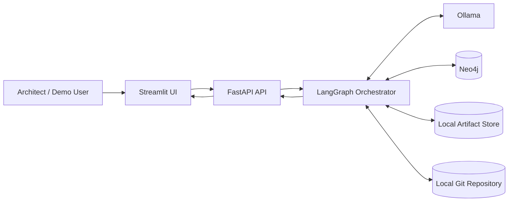
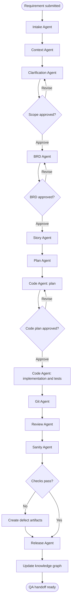
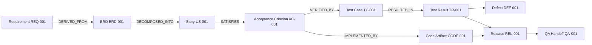

# SDLC Agentic Framework Architecture

## 1. Purpose

The SDLC Agentic Framework is a proof of concept that transforms one raw feature requirement into a traceable set of software-delivery artifacts. Eleven specialized agents coordinate requirement analysis, context retrieval, clarification, BRD generation, backlog planning, implementation planning, code generation, Git preparation, review, sanity testing, release handoff, and knowledge capture.

The proof of concept prioritizes:

- End-to-end artifact lineage.
- Human-in-the-loop (HITL) approval.
- Local, private inference through Ollama.
- Deterministic fallbacks for a reliable demonstration.
- A self-contained workflow that can be completed during a one-day hackathon.

## 2. Selected Technology Stack

| Layer | Technology | Responsibility |
|---|---|---|
| User interface | Streamlit | Requirement input, artifact display, approval actions, and run status |
| Backend API | FastAPI on Python | Workflow endpoints, validation, artifact access, and health checks |
| Agent orchestration | LangGraph | Stateful agent workflow, routing, retries, checkpoints, and HITL pauses |
| Local language model | Ollama | Local generation with no external LLM API key |
| Knowledge graph | Neo4j | Context retrieval and artifact lineage |
| Data validation | Pydantic | Typed workflow state and artifact schemas |
| Testing | pytest | Unit, integration, contract, and workflow tests |
| Packaging | Docker/Docker Compose | Optional deployment packaging; not required for local development |

Recommended baseline Ollama model: `qwen2.5-coder:7b`. It offers a practical balance between structured generation, coding capability, and local resource usage. The model name must remain configurable through an environment variable so another installed Ollama model can be used.

## 3. System Context



All services run locally for the PoC. The Streamlit application communicates with FastAPI rather than invoking agents directly. FastAPI starts or resumes the LangGraph workflow and exposes generated artifacts. LangGraph owns workflow state and calls Ollama, Neo4j, the artifact store, and safe local Git operations.

## 4. Logical Components

### 4.1 Streamlit UI

The UI provides:

- Plain-text input and optional file upload.
- A workflow timeline showing the current agent and status.
- Clarification questions and assumption confirmation.
- BRD and code-plan approval controls.
- Tabs for requirements, context, BRD, backlog, sprint plan, code, tests, review, QA handoff, and lineage.
- A final export/download action.

Excel, diagrams, and transcripts are part of the broader vision. For this PoC, plain text and text-based uploads are mandatory; other formats may use simple adapters or be demonstrated with prepared fixtures.

### 4.2 FastAPI Service

Suggested endpoints:

| Method | Endpoint | Purpose |
|---|---|---|
| `POST` | `/api/v1/runs` | Create a workflow run from a requirement |
| `GET` | `/api/v1/runs/{run_id}` | Read workflow status and summary |
| `POST` | `/api/v1/runs/{run_id}/resume` | Submit clarification answers or approval decisions |
| `GET` | `/api/v1/runs/{run_id}/artifacts` | List artifacts produced by a run |
| `GET` | `/api/v1/runs/{run_id}/artifacts/{artifact_id}` | Retrieve one artifact |
| `GET` | `/api/v1/runs/{run_id}/lineage` | Retrieve the traceability graph |
| `GET` | `/health` | Check API, Ollama, and Neo4j readiness |

FastAPI validates requests with Pydantic, translates API commands into LangGraph inputs, and returns stable DTOs. Long-running workflow work should run outside the request lifecycle or be resumed through short, checkpointed steps.

### 4.3 LangGraph Orchestrator

LangGraph maintains a typed `WorkflowState`, invokes agents, records node results, applies retry policies, and pauses at approval gates.



For the PoC, the Git Agent defaults to a dry-run plan. It may create a local feature branch and commit only when explicitly enabled. Push and pull-request creation are represented as generated commands or mock responses unless a remote repository is configured and the user explicitly authorizes those actions.

### 4.4 Ollama LLM Gateway

Agents must call a shared LLM gateway rather than the Ollama client directly. The gateway provides:

- Model and endpoint configuration.
- Structured JSON generation.
- Prompt templates and response parsing.
- Timeouts and bounded retries.
- Generation metadata such as model, latency, and fallback usage.
- Deterministic template fallback when the model is unavailable or returns invalid structured output.

Suggested defaults:

```text
OLLAMA_BASE_URL=http://localhost:11434
OLLAMA_MODEL=qwen2.5-coder:7b
OLLAMA_TEMPERATURE=0.1
```

Prompts should request JSON matching a Pydantic schema. Invalid responses are repaired once, then replaced by a deterministic template with a visible `fallback_used` flag.

### 4.5 Neo4j Knowledge Graph

Neo4j supports both prior-context retrieval and new artifact lineage.

Core node labels:

- `Requirement`
- `Assumption`
- `Decision`
- `BRD`
- `Epic`
- `Story`
- `AcceptanceCriterion`
- `CodeArtifact`
- `TestCase`
- `TestResult`
- `Defect`
- `Release`
- `QAHandoff`

Core relationships:

- `DERIVED_FROM`
- `CLARIFIED_BY`
- `APPROVED_BY`
- `DECOMPOSED_INTO`
- `SATISFIES`
- `IMPLEMENTED_BY`
- `VERIFIED_BY`
- `RESULTED_IN`
- `BLOCKED_BY`
- `PACKAGED_IN`
- `RELATED_TO`

Example lineage:



The demo starts with seeded mock nodes representing earlier BRDs, decisions, reusable patterns, and defects. If Neo4j is unavailable, a fixture-backed context provider and local lineage JSON preserve the demonstration path.

### 4.6 Artifact Store

Every run writes human-readable JSON and Markdown artifacts beneath:

```text
artifacts/
  <run_id>/
    manifest.json
    requirement.json
    context-pack.json
    clarifications.json
    brd.md
    backlog.json
    sprint-plan.md
    code-plan.md
    generated/
    review-findings.json
    sanity-results.json
    defects.json
    release-notes.md
    qa-handoff.md
    lineage.json
```

`manifest.json` is the authoritative index and includes artifact IDs, types, versions, checksums, creation timestamps, producer agents, source IDs, approval state, and file locations.

## 5. Agent Responsibilities

| # | Agent | Input | Primary output |
|---|---|---|---|
| 1 | Intake Agent | Raw text or uploaded content | Normalized requirement |
| 2 | Context Agent | Normalized requirement | Related context pack |
| 3 | Clarification Agent | Requirement and context | Questions, answers, assumptions, scope decision |
| 4 | BRD Agent | Approved scope | Versioned BRD with confidence scores |
| 5 | Story Agent | Approved BRD | Epics, stories, subtasks, acceptance criteria, estimates |
| 6 | Plan Agent | Backlog and dependencies | Sprint plan, sequence, critical path, risks |
| 7 | Code Agent | Approved stories and code plan | Code plan, implementation stub, unit tests |
| 8 | Git Agent | Generated changes | Branch/commit plan and optional local Git changes |
| 9 | Review Agent | BRD, criteria, and code | Severity-ranked traceable findings |
| 10 | Sanity Agent | Code, tests, and criteria | Test results, coverage map, defects |
| 11 | Release Agent | All preceding artifacts | Release notes, QA handoff, lineage update |

The Release Agent performs knowledge graph persistence as the final phase of its responsibility, avoiding the need for a twelfth agent.

## 6. Workflow State

The shared state should contain IDs or compact summaries rather than copying every full document between nodes.

```python
class WorkflowState(TypedDict):
    run_id: str
    status: str
    current_node: str
    requirement: dict
    context_pack: dict
    clarifications: list[dict]
    assumptions: list[dict]
    approvals: dict
    artifact_refs: dict[str, str]
    acceptance_criteria: list[dict]
    review_findings: list[dict]
    test_results: list[dict]
    defects: list[dict]
    errors: list[dict]
    fallback_events: list[dict]
```

Checkpoint state after each node. A run can then be inspected, resumed after an approval, or retried without repeating completed work.

## 7. Traceability and Versioning

All artifacts use stable, readable IDs:

- `REQ-001`, `BRD-001`, `EPIC-001`, `US-001`
- `AC-001`, `CODE-001`, `TC-001`, `TR-001`
- `DEF-001`, `REL-001`, `QA-001`

Each derived artifact records:

- `artifact_id`
- `artifact_type`
- `version`
- `run_id`
- `source_artifact_ids`
- `producer_agent`
- `created_at`
- `approval_status`
- `model_metadata`
- `confidence`

Generated code, review findings, and test results must reference the acceptance-criteria IDs they address. An artifact is not considered handoff-ready when a required criterion lacks an implementation or test mapping.

## 8. Human-in-the-Loop Gates

Three approval gates keep the architect in control:

1. **Scope gate:** confirm clarified scope and assumptions.
2. **BRD gate:** approve or request changes to the business requirements.
3. **Code-plan gate:** approve design intent before implementation generation.

LangGraph interrupts the run at each gate. FastAPI returns `WAITING_FOR_APPROVAL`, and Streamlit shows the artifact, decision controls, and an optional comment field. Rejections append feedback and route back to the owning agent without erasing earlier versions.

## 9. Reliability and Failure Handling

- Validate every agent output with Pydantic.
- Use low-temperature local inference for repeatability.
- Retry transient Ollama and Neo4j failures with bounded exponential backoff.
- Use template fallbacks for all generative nodes.
- Save an artifact after every successful node.
- Mark partial results and fallback use clearly in the UI and manifest.
- Never allow a failed optional Git operation to erase generated artifacts.
- Make nodes idempotent using `run_id`, artifact type, and version.

## 10. Security and Governance

- No external LLM API keys or cloud inference.
- Store secrets only in `.env`; never commit them.
- Restrict uploaded file types and sizes.
- Sanitize filenames and generated paths.
- Do not execute arbitrary model-generated shell commands.
- Allow-list local Git actions and default them to dry-run.
- Parameterize Cypher queries to prevent injection.
- Record prompts, approvals, model metadata, and fallback events for auditability.
- Avoid placing confidential requirement text in application logs.

Authentication and role-based access are deferred for the hackathon PoC, but the API boundary permits them to be added later.

## 11. Suggested Repository Structure

```text
.
├── api/
│   ├── main.py
│   ├── routes/
│   └── schemas/
├── app/
│   └── streamlit_app.py
├── sdlc/
│   ├── agents/
│   ├── graph/
│   ├── models/
│   ├── prompts/
│   ├── services/
│   ├── fallbacks/
│   └── config.py
├── tests/
│   ├── unit/
│   ├── integration/
│   ├── contract/
│   └── fixtures/
├── scripts/
│   └── seed_neo4j.py
├── artifacts/
├── .env.example
├── docker-compose.yml
├── Dockerfile.api
├── Dockerfile.ui
├── Architecture.md
├── Plan.md
├── Prompts.md
└── README.md
```

## 12. PoC Boundaries

Included:

- One feature requirement per run.
- Text input and text-based artifact upload.
- Mock prior knowledge.
- Three HITL gates.
- Generated BRD, backlog, plan, implementation stub, tests, review, sanity results, defects, release notes, QA handoff, and lineage.
- Native local execution.
- Optional Docker definitions for later use.

Deferred:

- Production authentication and authorization.
- Real Jira, GitHub, GitLab, Azure DevOps, or CI/CD integrations.
- Autonomous remote pushes and pull requests.
- Enterprise-scale document parsing.
- Concurrent multi-tenant workflows.
- Production observability, high availability, and backup.

